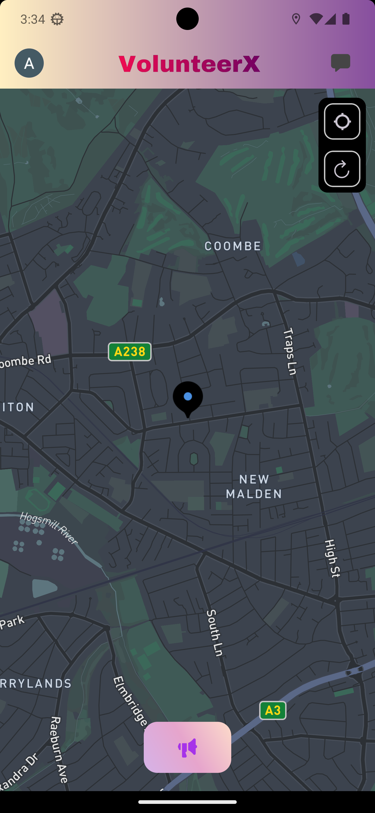
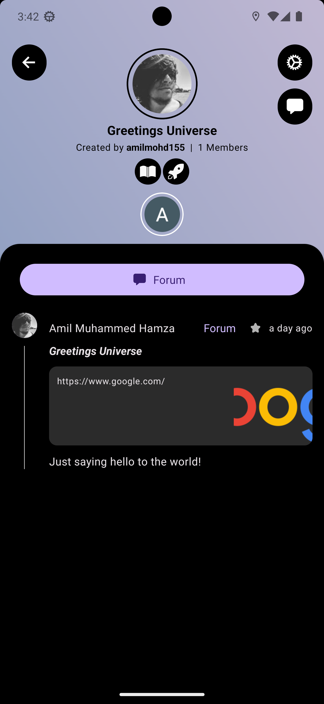
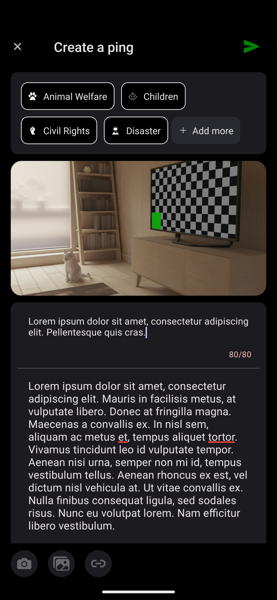
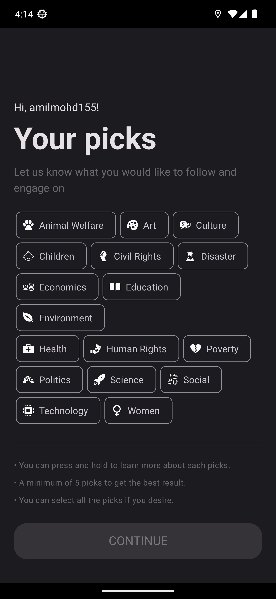
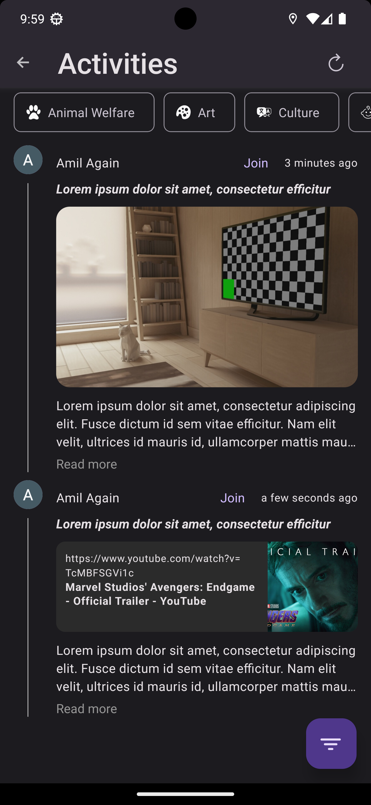

> [!WARNING]
> Project currently under active development.

# VolunteerX

VolunteerX a quasi localized social networking for volunteers. It is a platform where we sync the innovative minds to resolve real-life problems and bring changes to the world. We collaborate with local people to bring the difference they want to see. 

## Tech Stack

- React Native
- Redux Toolkit
- Mapbox
- Apollo GraphQL
- AWS S3
- Firebase Cloud Messaging
- Notifee
- Socket.io

## Features

- Localised Posts
- Authenticated User Account
- Instagram Like Horizontal Swipe Media View
- File upload using [AWS S3 pre-signed URLs](https://docs.aws.amazon.com/AmazonS3/latest/userguide/using-presigned-url.html)
- Firebase Cloud Messaging
- Cross platform


## Roadmap

- Forums
- Event management
- Activity admin features
- App settings
- Media editing
- Testing
- GraphQL error handling
- React 18 concurrency integration
- React Native new architecture

## Screenshots

           
           

[More Screenshots!!](./Screenshots)


## Run Locally

- Install server and run for better result. See Server repo link in [Related Section](#related)

Clone the project

```bash
  git clone https://github.com/Volunteer-X/Client.git
```

Go to the project directory

```bash
  cd client
```

Install dependencies

```bash
  npm install
```

Start metro

```bash
  npm run start
```
```bash
  android
``` 

Currently only supports android. Not tested for IOS.


## Environment Variables

To run this project, you will need to add the following environment variables to your .env file

Google Map

`MAP_API_KEY`

Mapbox

`MAPBOX_API`
`MAPBOX_STYLE_LIGHT`

Auth0

`AUTH0_CLIENT`
`AUTH0_DOMAIN`
`AUTH0_SCOPE`

Port

`DEV_SCHEME=http`
`DEV_HOST=localhost`
`DEV_PORT=3500`
`DEV_HTTP_PATH=graphql`
`DEV_WS_PATH=subscriptions`
`DEV_FILE_PATH=3550`
`DEV_SOCKET=5050`
`DEV_FILE=http://localhost:3550/api/v1/`

## Related

Here are some related projects

[Server README](https://github.com/Volunteer-X/Server/blob/master/README.md)


## License

[MIT](./LICENSE)


## Feedback

If you have any feedback, please reach out to us at amilmoh155@gmail.com.


## Authors

- [@amilmohd155](https://github.com/amilmohd155)
